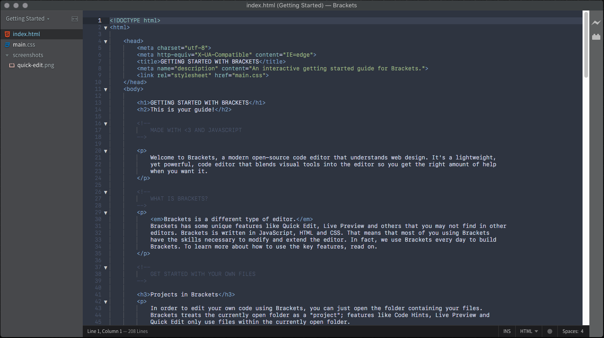

An arctic, north-bluish clean and elegant <a href="http://brackets.io/">Brackets</a> theme.

Designed for a fluent and clear workflow. 
Based on the <a href="https://github.com/arcticicestudio/nord">Nord</a> color palette.

## Getting started
### Installation
1. Open Brackets.
2. Open the `Extension Manager`.
3. Switch to `Themes` tab.
4. Search for `Nord`.
5. Click `Install`.
6. `View` -> `Themes...` -> `Nord`.

## Development
  

### Contribution
Please report issues/bugs, feature requests and suggestions for improvements to the [issue tracker](https://github.com/arcticicestudio/nord-visual-studio-code/issues).

  Copyright &copy; 2017 Arctic Ice Studio

 

[scrot-lang-c]: https://raw.githubusercontent.com/arcticicestudio/nord-visual-studio-code/develop/assets/scrot-lang-c.png
[scrot-lang-css]: https://raw.githubusercontent.com/arcticicestudio/nord-visual-studio-code/develop/assets/scrot-lang-css.png
[scrot-lang-diff]: https://raw.githubusercontent.com/arcticicestudio/nord-visual-studio-code/develop/assets/scrot-lang-diff.png
[scrot-lang-java]: https://raw.githubusercontent.com/arcticicestudio/nord-visual-studio-code/develop/assets/scrot-lang-java.png
[scrot-lang-javascript]: https://raw.githubusercontent.com/arcticicestudio/nord-visual-studio-code/develop/assets/scrot-lang-javascript.png
[scrot-lang-json]: https://raw.githubusercontent.com/arcticicestudio/nord-visual-studio-code/develop/assets/scrot-lang-json.png
[scrot-lang-markdown]: https://raw.githubusercontent.com/arcticicestudio/nord-visual-studio-code/develop/assets/scrot-lang-markdown.png
[scrot-lang-php]: https://raw.githubusercontent.com/arcticicestudio/nord-visual-studio-code/develop/assets/scrot-lang-php.png
[scrot-lang-python]: https://raw.githubusercontent.com/arcticicestudio/nord-visual-studio-code/develop/assets/scrot-lang-python.png
[scrot-lang-ruby]: https://raw.githubusercontent.com/arcticicestudio/nord-visual-studio-code/develop/assets/scrot-lang-ruby.png
[scrot-lang-xml]: https://raw.githubusercontent.com/arcticicestudio/nord-visual-studio-code/develop/assets/scrot-lang-xml.png
[scrot-lang-yaml]: https://raw.githubusercontent.com/arcticicestudio/nord-visual-studio-code/develop/assets/scrot-lang-yaml.png
